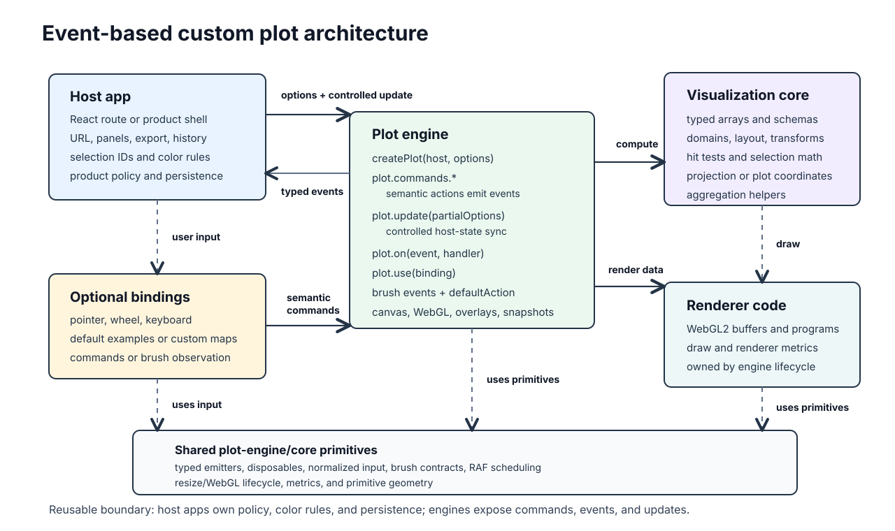

# m-charts

`m-charts` is a WebGL2 charting library built for high-performance data
exploration in the browser. It provides framework-neutral chart engines for
scatter plots, histograms, and parallel-coordinate plots, plus a Vite demo app
that shows how to wire them into a product shell.

The project is useful when the chart needs to stay fast under dense typed-array
data, expose semantic commands and typed events, and let the host application own
the surrounding UI. The renderer creates and manages WebGL2 canvases; your app
owns data loading, layout, side panels, URL state, overlays, exports, persistence,
and product policy.

## Public Usage Status

`m-charts` is not published to npm yet, and `npm install m-charts` is not a
supported consumer path. The current public integration path is source-copy:
copy the relevant chart source from `packages/m-charts/src` into the host
application, then rewrite imports to the copied local module paths.

Start with [docs/source-copy-integration.md](docs/source-copy-integration.md)
when integrating into another application.

## Features

- WebGL2 scatter, histogram, and parallel-coordinate engines.
- Typed-array data contracts for high-volume rendering and selection flows.
- Framework-neutral `core` and `engine` modules with optional React helpers.
- Imperative lifecycle: create a plot in a DOM host, call `update(...)`, invoke
  `commands.*`, observe `plot.on(...)`, attach optional bindings with `use(...)`,
  and release resources with `dispose()`.
- Host-rendered overlay descriptors for brushes, hover guides, measurement
  guides, navigator state, and inspection UI.

## Browser Support

The engines require WebGL2 and modern browser APIs such as typed arrays,
`ResizeObserver`, and pointer events. Target current evergreen Chromium,
Firefox, and Safari versions with WebGL2 enabled. IE and WebGL1-only
environments are unsupported.

## Architecture

The custom plot architecture uses a small stateful engine around
framework-neutral core logic. The engine exposes semantic commands, emits typed
events, and reconciles controlled host state through `plot.update(...)`.
Bindings, demo routes, and host applications decide how user input, URL state,
panels, keyboard shortcuts, exports, overlays, and persistence connect to those
commands, updates, and events.



The mental model:

- `packages/m-charts/src/plot-engine/core` provides chart-agnostic browser
  primitives: typed emitters, disposables, normalized DOM input, brush metadata,
  resize/WebGL context lifecycle, geometry, metrics, and RAF scheduling.
- `packages/m-charts/src/<viz>/core` is pure visualization logic: typed data
  contracts, buffer builders, domains, transforms, hit testing, selection math,
  aggregation, formatting, and WebGL renderer helpers.
- `packages/m-charts/src/<viz>/engine` is the reusable plot API. It takes a
  host element, creates its canvas or canvases, owns renderer lifecycle, exposes
  `plot.commands`, emits typed events through `plot.on(...)`, accepts
  `plot.update(...)`, and supports attachable bindings with `plot.use(...)`.
- `packages/m-charts/src/<viz>/engine/default...Bindings.ts` translates
  normalized pointer, wheel, and keyboard input into engine commands. These
  bindings are optional; another product can replace or extend them without
  changing the renderer.
- Demo routes in `apps/demo` are app glue. They load datasets, adapt data, store
  URL/search state, render sidebars and overlays, materialize selected IDs,
  handle export policy, and subscribe to engine events.

The diagram separates renderer code visually for readability. In the codebase,
renderer implementations live inside each visualization `core` package, while
the corresponding `engine` package owns canvas, resize, WebGL, and render-loop
lifecycle.

Keep reusable `core` and `engine` modules independent of React, React Router,
demo routes, generated fixtures, app state, theme modules, local environment
setup, and app-only code. This is the boundary that makes scatter, histograms,
parallel coordinates, and future visualization types copyable.

## Engine Contract

Every chart engine should follow the same public shape:

- `plot.update(partialOptions)` reconciles controlled host state. It is the
  right path for React props, URL-restored state, theme/style changes,
  externally owned selections, and renderer options. It should be silent unless
  a field explicitly documents event emission.
- `plot.commands.*` is the semantic action API. Commands used by bindings,
  route handlers, or programmatic tools mutate engine-owned interactive state
  and emit matching typed events when observers need to react.
- `plot.on(event, handler)` is the observation API. Events should carry compact
  typed arrays, viewport ranges, source indices, brush ranges, filters, and
  action metadata such as `reason`, `phase`, or `source`; hosts materialize
  records, IDs, exports, and backend filters lazily.
- `plot.use(binding)` attaches optional input or integration bindings. Default
  bindings are reusable interaction policy, not hard-coded product shortcuts.
- Overlay state should be described with plain descriptors. Host applications
  choose whether to render overlays in DOM, SVG, canvas, React, or another UI
  layer.

Default interactions can vary by chart family, but the contract should stay
consistent: navigation, selection, hover/inspection, measurement, overlays, and
keyboard shortcuts flow through commands, updates, and events instead of moving
product policy into renderer code. Chart-specific interaction details live in
the package notes:

- [packages/m-charts/SCATTER.md](packages/m-charts/SCATTER.md)
- [packages/m-charts/HISTOGRAM.md](packages/m-charts/HISTOGRAM.md)
- [packages/m-charts/PARALLEL.md](packages/m-charts/PARALLEL.md)

For the detailed integration reference, see
[packages/m-charts/llms.md](packages/m-charts/llms.md).

## Quick Source-Copy Shape

Copy `packages/m-charts/src/plot-engine` plus the chart `core` and `engine`
folders you need into a host application, for example `src/vendor/m-charts`.
Add `adapters`, scatter `workers`, or chart `react` folders only when the host
uses those optional helpers. Then rewrite package imports to local imports:

```ts
import { createScatterPlot } from './vendor/m-charts/m-scatter/engine/index.js';
```

Each plot needs a sized host element:

```html
<div id="chart" style="height: 420px; position: relative"></div>
```

Dispose plots when the screen or component unmounts:

```ts
const plot = createScatterPlot(host, options);

window.addEventListener('beforeunload', () => {
  plot.dispose();
});
```

## Minimal Examples

These examples assume you copied the source into `src/vendor/m-charts` and rewrote
imports to local module paths. They show the engine boundary only; real apps
usually build typed arrays from backend results or application data models.

### Scatter

```ts
import {
  calculateScatterDomain,
  createDefaultScatterViewport,
} from './vendor/m-charts/m-scatter/core/index.js';
import {
  createDefaultScatterBindings,
  createScatterPlot,
} from './vendor/m-charts/m-scatter/engine/index.js';

const host = document.querySelector<HTMLDivElement>('#chart');
if (!host) throw new Error('Missing #chart');

const columns = {
  ids: ['a', 'b', 'c'],
  x: new Float32Array([0, 1, 2]),
  y: { value: new Float32Array([3, 1, 4]) },
};

const spec = {
  xLabel: 'X',
  plots: [{ id: 'value', label: 'Value', yKey: 'value' }],
};

const viewport = createDefaultScatterViewport(
  calculateScatterDomain(columns, spec),
);
const plot = createScatterPlot(host, {
  axisMode: 'xy',
  columns,
  mode: 'zoom',
  spec,
  viewport,
});

plot.use(createDefaultScatterBindings());
plot.on('selectionchange', (event) => {
  console.log(event.selectedCount);
});
```

### Histogram

```ts
import {
  createDefaultHistogramBindings,
  createHistogramPlot,
} from './vendor/m-charts/m-histogram/engine/index.js';
import {
  buildHistogramAggregation,
  createDefaultHistogramViewport,
} from './vendor/m-charts/m-histogram/core/index.js';

const host = document.querySelector<HTMLDivElement>('#chart');
if (!host) throw new Error('Missing #chart');

const parameter = {
  key: 'latency',
  kind: 'numeric' as const,
  label: 'Latency',
};
const spec = {
  mode: 'histogram' as const,
  parameters: [parameter],
  subplots: [{ id: 'latency', label: 'Latency', parameterKey: 'latency' }],
};
const columns = {
  ids: ['a', 'b', 'c', 'd'],
  valuesByParameter: { latency: new Float32Array([12, 18, 21, 35]) },
};
const aggregation = buildHistogramAggregation(columns, { plotSpec: spec });
const viewport = createDefaultHistogramViewport(aggregation);

const plot = createHistogramPlot(host, {
  aggregation,
  columns,
  spec,
  viewport,
});

plot.use(createDefaultHistogramBindings());
```

### Parallel Coordinates

```ts
import {
  createDefaultParallelBindings,
  createParallelPlot,
} from './vendor/m-charts/m-parallel/engine/index.js';
import {
  createParallelFastBuffersFromDataset,
} from './vendor/m-charts/m-parallel/adapters/index.js';

const host = document.querySelector<HTMLDivElement>('#chart');
if (!host) throw new Error('Missing #chart');

const buffers = createParallelFastBuffersFromDataset(
  {
    metadata: { attributes: { parameters: ['speed', 'power', 'risk'] } },
    records: [
      { id: 'a', speed: 10, power: 0.8, risk: 3 },
      { id: 'b', speed: 12, power: 0.5, risk: 5 },
    ],
  },
  { includeWebglSegmentBuffers: true },
);

const plot = createParallelPlot(host, { buffers });
plot.use(createDefaultParallelBindings());
plot.on('selectionchange', (event) => {
  console.log(event.selectedCount);
});
```

## Demo App

Install workspace dependencies, generate local demo data, and run the Vite app:

```sh
pnpm install
pnpm generate:data:local
pnpm dev
```

The demo routes are:

- `/`: overview
- `/m-scatter`, `/m-scatter?tables=multi`, `/m-scatter-fixture`
- `/m-parallel`, `/m-parallel?tables=multi`, `/m-parallel-fixture`
- `/m-histogram`, `/m-histogram?tables=multi`,
  `/m-histogram?histMode=bar`, `/m-histogram-fixture`
- `?theme=light|dark` works on demo routes

Generated demo data lives under `apps/demo/public/data/`, is ignored by git, and
is not part of the reusable package source.

## Repository Structure

```text
packages/m-charts/src/plot-engine
packages/m-charts/src/m-scatter
packages/m-charts/src/m-parallel
packages/m-charts/src/m-histogram
apps/demo/src
tests/unit
tests/e2e
docs
```

Core and engine modules are framework-neutral. Demo routes, generated data,
local data loaders, URL state, theme state, panels, and e2e hooks live in
`apps/demo`.

Package notes:

- [packages/m-charts/README.md](packages/m-charts/README.md)
- [packages/m-charts/SCATTER.md](packages/m-charts/SCATTER.md)
- [packages/m-charts/HISTOGRAM.md](packages/m-charts/HISTOGRAM.md)
- [packages/m-charts/PARALLEL.md](packages/m-charts/PARALLEL.md)
- [packages/m-charts/llms.md](packages/m-charts/llms.md)
- [docs/adding-visualization-type.md](docs/adding-visualization-type.md)

## Benchmarks

Benchmark helpers are separate from normal validation:

```sh
pnpm benchmark:scatter:custom
pnpm benchmark:histogram:custom
pnpm benchmark:parallel:custom
```

Use benchmark results as evidence for renderer or interaction changes, but keep
detailed run notes out of this README unless they change the project direction.

## Validation

Use the narrowest useful check while iterating, then run broader validation for
shared behavior:

```sh
pnpm typecheck
pnpm lint
pnpm test:unit
pnpm test:e2e
pnpm build
```

Task-specific documentation changes should at least pass:

```sh
pnpm typecheck
pnpm lint
```

## Issues

Issues can be opened at any time for bugs, documentation gaps, integration
questions, and focused feature requests. Pull requests are not a primary project
workflow right now, so open an issue first before spending time on
implementation work.

## Security

Do not include exploitable vulnerability details in a public issue. See
[SECURITY.md](SECURITY.md) for supported versions and private reporting
instructions.

## License

MIT. See [LICENSE](LICENSE).
